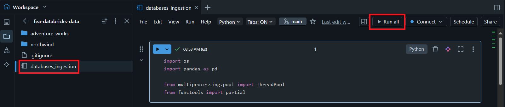
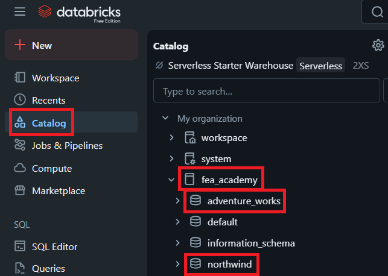

<br>

<div align="center" style="border: 3px solid #ff4d4d; padding: 20px; background-color: #fff5f5;">
  
  <h1 style="color: #000000 ">Projeto de Dados - Formação em Engenharia de Analytics</h1>
</div>

<br>

<div align="center" style="border: 3px solid #ff4d4d; padding: 5px; background-color: #fff5f5;">
<br>
  <h1 style="color: #ff4d4d">⚠️ ATENÇÃO: ESTE É UM REPOSITÓRIO PÚBLICO ⚠️</h1>
</div>

## Todo o conteúdo presente neste repositório é de acesso público. Não adicione informações sensíveis, chaves de acesso, senhas ou quaisquer outros dados confidenciais

## Visão Geral

Bem-vindo(a) à **Formação em Engenharia de Analytics**!

Este repositório é o ponto de partida para as nossas aulas práticas. Ele contém o código necessário para criar em seu ambiente Databricks as tabelas e os dados que serão utilizados ao longo do curso.

O objetivo é simples: rodar um único notebook que irá gerar automaticamente todas as bases de dados necessárias para os exercícios, utilizando os famosos bancos de dados de estudo: `Northwind` e `AdventureWorks`.

## Objetivo Principal

Ao final do processo, você terá um novo catálogo em seu Databricks chamado `fea_academy`. Dentro dele, estarão os schemas (conjuntos de tabelas) `northwind` e `adventure_works`, prontos para serem explorados.

## Pré-requisitos

Antes de começar, você precisa apenas de acesso a um workspace [Databricks Free Edition](https://docs.databricks.com/aws/en/getting-started/free-edition).

## Tutorial: Configurando o Repositório no Databricks (Git Folders)

Para ter acesso aos arquivos do curso, vamos clonar este repositório diretamente para dentro do seu Databricks. Siga os passos abaixo com atenção:

**Acesse a Seção de Repositórios:**

1. No menu lateral esquerdo do Databricks, clique em **+ New**

2. Dentro dele, clique em **More**

3. E, por fim, clique em **Git folder**.

    

**Adicione um Novo Repositório:**

1. **Preencha a URL do Repositório:**
    No campo **URL do repositório Git (Git repository URL)**, cole a seguinte URL:
    ```
    https://bitbucket.org/indiciumtech/fea-databricks-data.git
    ```
    O campo "Nome do repositório" (Git folder name) será preenchido automaticamente como `fea-databricks-data`. Mantenha o provedor Git como "Bitbucket".

2. **Clone o Repositório:**
    Clique no botão azul **Criar Repositório (Create Git folder)**. O Databricks irá se conectar ao Bitbucket e baixar todos os arquivos.


Pronto! Agora você deve ver a pasta `fea-databricks-data` no seu workspace.


## Como Gerar as Tabelas

Com o repositório configurado, o próximo passo é executar o código para criar as tabelas.

1.  **Abra o Notebook de Ingestão:**
    Dentro da pasta `fea-databricks-data` que você acabou de clonar, encontre e clique no notebook chamado `databases_ingestion`.

2.  **Execute o Notebook:**
    Clique no botão **Executar tudo (Run all)**, localizado na barra de ferramentas superior do notebook.

    O processo de execução do notebook deve levar **aproximadamente 2 minutos**.



## Resultado Esperado

Após a conclusão bem-sucedida de todas as células, você poderá ir até o **Catálogo (Catalog)** no menu lateral do Databricks e verificar o seguinte:

-   Um novo catálogo chamado `fea_academy` foi criado.
-   Dentro dele, você encontrará dois schemas:
    -   `adventure_works`
    -   `northwind`
-   Cada um desses schemas conterá as tabelas necessárias para as aulas.



Se você chegou até aqui, seu ambiente está configurado com sucesso e pronto para o curso!

---

**Mantido por:**

