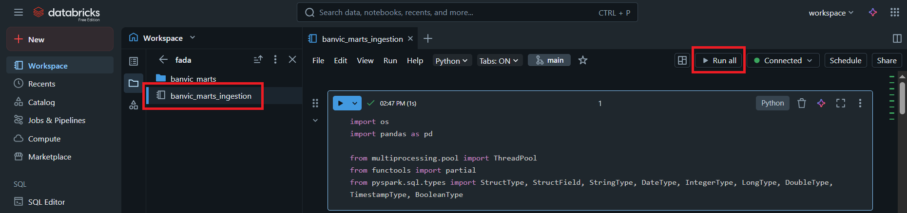
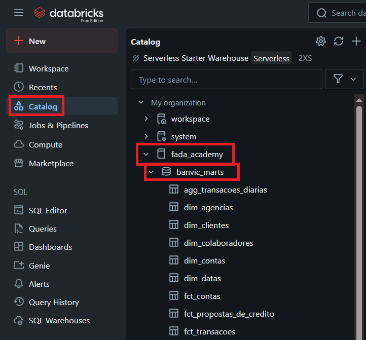

 

  

 

<h1 align="center"> Formação em Análise de Dados </h1>

 

## Como Gerar as Tabelas

Com o repositório configurado, o próximo passo é executar o código para criar as tabelas.

1.  **Abra o Notebook de Ingestão:**
    Dentro da pasta `databricks-datasources` que você acabou de clonar, clique na pasta `fada`, encontre e clique no notebook chamado `banvic_marts_ingestion`.

2.  **Execute o Notebook:**
    Clique no botão **Executar tudo (Run all)**, localizado na barra de ferramentas superior do notebook.

    O processo de execução do notebook deve levar **aproximadamente 2 minutos**.

## Resultado Esperado

Após a conclusão bem-sucedida de todas as células, você poderá ir até o **Catálogo (Catalog)** no menu lateral do Databricks e verificar o seguinte:

-   Um novo catálogo chamado `fada_academy` foi criado.
-   Dentro dele, você encontrará um schema:
    -   `banvic_marts`
-   Ele conterá as tabelas necessárias para as aulas.

Se você chegou até aqui, seu ambiente está configurado com sucesso e pronto para o curso!